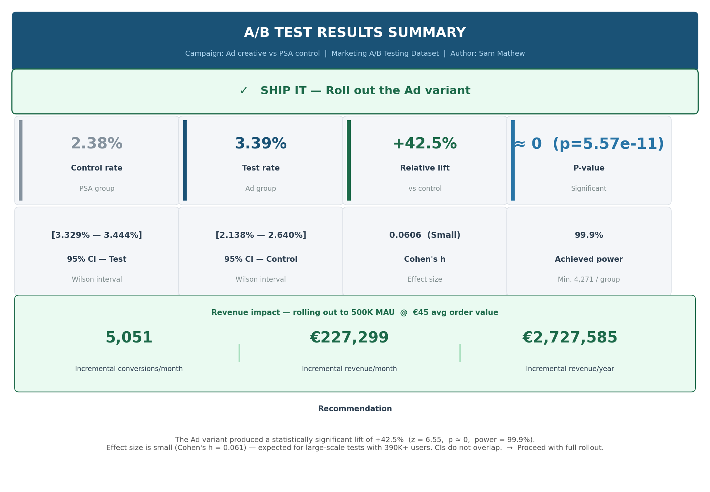
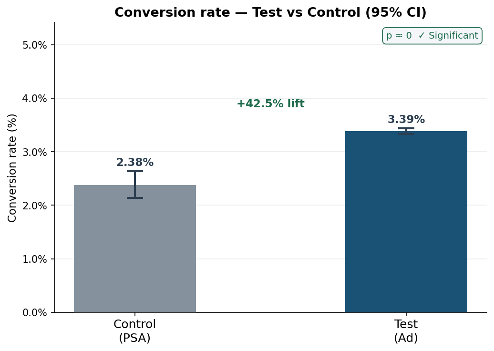
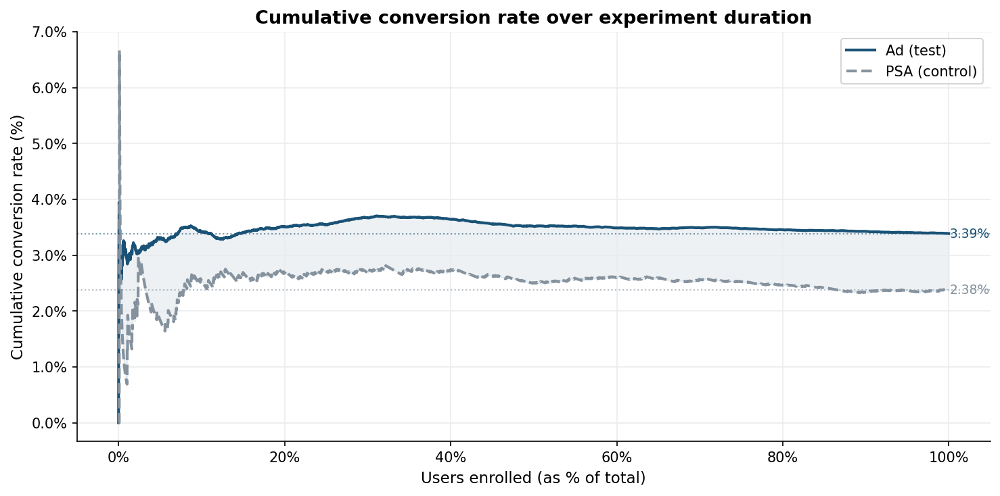
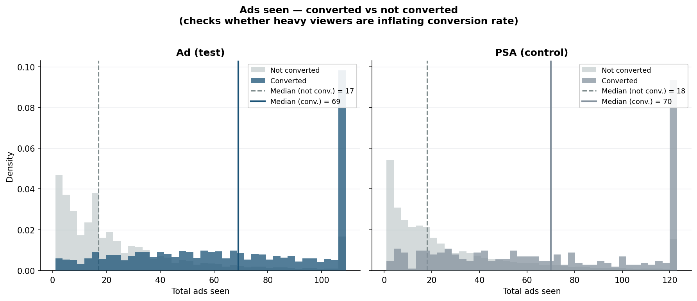
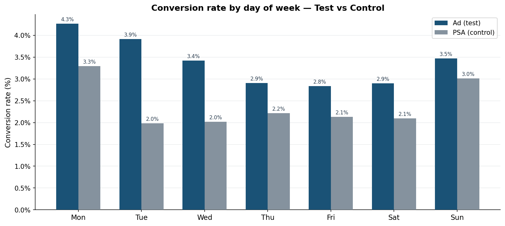

# A/B Test Campaign Analysis
### Marketing ad creative vs PSA control — statistical significance, effect size & revenue impact

---

## Overview
A complete A/B test analysis on a real marketing dataset of **392,402 users**,
testing whether an ad creative drives higher conversion rates than a
Public Service Announcement (PSA) control group.

**Result: The ad variant produced a statistically significant +42.5% 
conversion lift — equivalent to €2.7M in projected annual revenue.**

---

## Key results

| Metric | Value |
|---|---|
| Control (PSA) conversion rate | 2.38% |
| Test (Ad) conversion rate | 3.39% |
| Relative lift | +42.52% |
| Z-statistic | 6.55 |
| P-value | 5.57e-11 |
| 95% CI — Test | [3.33%, 3.44%] |
| 95% CI — Control | [2.14%, 2.64%] |
| Cohen's h | 0.0606 (Small) |
| Achieved power | 99.9% |
| Incremental revenue / year | €2,727,585 |

---

## Charts

| | |
|---|---|
|  |  |
|  |  |

---

## Methodology
1. Data loading, quality checks and cleaning
2. Group size analysis and conversion KPI calculation
3. Two-proportion z-test (two-sided, α = 0.05)
4. Wilson 95% confidence intervals
5. Cohen's h effect size
6. Power analysis (NormalIndPower)
7. Exposure bias investigation
8. Day-of-week conversion breakdown
9. Revenue impact estimation

---

## Tools
Python · Pandas · NumPy · Matplotlib · SciPy · Statsmodels · Google Colab

---

## Dataset
[Marketing A/B Testing — Kaggle](https://www.kaggle.com/datasets/faviovaz/marketing-ab-testing)
392,402 users · Ad group: 378,261 · PSA control: 14,141

---

## Author
**Sam Mathew** — Marketing Data Analyst · Berlin  
[LinkedIn](https://www.linkedin.com/in/sammathew07/) · sammathew.mj@gmail.com
